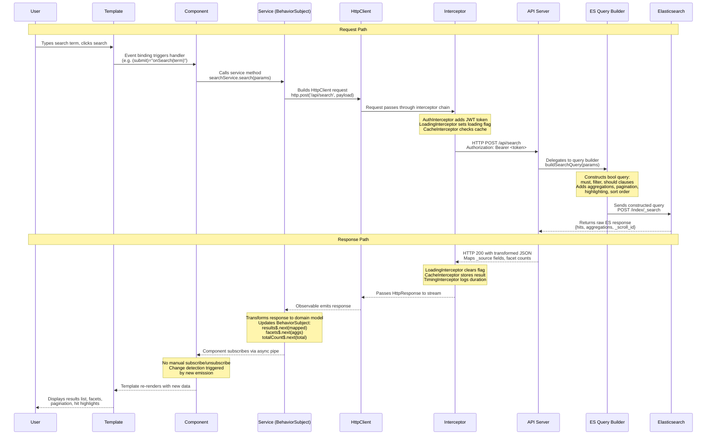

# Data Flow Architecture

Complete request-response cycle for a search operation in an Angular 14 + Elasticsearch application.

## Mermaid Diagram

## Text Description

Each step in the request-response cycle, its responsibilities, and what crosses each boundary.

### Request Path

| Step | Actor | Responsibility | Output |
|------|-------|---------------|--------|
| 1 | **User** | Types a search term into the search input and triggers submission (click, Enter key, or debounced input). | DOM event |
| 2 | **Template** | Angular event binding (e.g., `(submit)="onSearch(form.value)"`) converts the DOM event into a component method call. Template is responsible for gathering form values and passing them as typed arguments. | Method call with search parameters |
| 3 | **Component** | Validates input if needed, constructs a search request object, and delegates to the service. The component does not know about HTTP or Elasticsearch. It only speaks in domain terms: `searchService.search({ query, filters, page })`. | Service method invocation |
| 4 | **Service** | Translates the domain request into an HTTP call. Holds the API endpoint URL. Calls `httpClient.post<SearchResponse>('/api/search', payload)`. Returns an `Observable<SearchResult[]>` (not raw HTTP). | `Observable<HttpResponse>` in the HttpClient pipeline |
| 5 | **HttpClient** | Angular's `HttpClient` serializes the body to JSON, sets `Content-Type`, and pushes the request into the interceptor chain. | `HttpRequest` object |
| 6 | **Interceptor Chain** | Multiple interceptors process the request in order: (a) `AuthInterceptor` clones the request and adds the `Authorization: Bearer <token>` header; (b) `LoadingInterceptor` sets a global loading flag to `true`; (c) `CacheInterceptor` checks if an identical request exists in cache and short-circuits if so. | Modified `HttpRequest` forwarded via `next.handle(req)` |
| 7 | **API Server** | Receives the authenticated HTTP request. Validates the JWT. Extracts search parameters from the body. Delegates to the query builder. | Parsed search parameters |
| 8 | **Elasticsearch Query Builder** | Constructs the Elasticsearch query DSL. Builds `bool` queries with `must` (full-text match), `filter` (exact term filters, range), and `should` (boosting) clauses. Adds `aggs` for facets, `from`/`size` for pagination, `highlight` for term highlighting, and `sort` for ordering. | Elasticsearch query JSON |
| 9 | **Elasticsearch** | Executes the query against the index. Scores and ranks documents. Computes aggregation buckets. Returns raw response with `hits.hits[]`, `hits.total`, and `aggregations`. | Raw Elasticsearch response |

### Response Path

| Step | Actor | Responsibility | Output |
|------|-------|---------------|--------|
| 10 | **API Server** | Transforms the raw Elasticsearch response into a clean API response. Maps `_source` fields to API contract names. Flattens aggregation buckets into facet arrays. Strips internal ES metadata (`_index`, `_type`, `_score`). | HTTP 200 JSON response |
| 11 | **Interceptor Chain (return)** | Interceptors process the response in reverse order: (a) `TimingInterceptor` logs request duration; (b) `CacheInterceptor` stores the response for future identical requests; (c) `LoadingInterceptor` sets the global loading flag to `false`. | `HttpResponse` passed upstream |
| 12 | **HttpClient** | Deserializes the JSON response body into the generic type specified by the service (`SearchResponse`). Emits on the observable stream. | Typed response object |
| 13 | **Service (BehaviorSubject)** | Transforms the API response into domain models. Updates multiple `BehaviorSubject` streams: `results$.next(mappedResults)` for the result list, `facets$.next(mappedAggs)` for filter facets, `totalCount$.next(total)` for pagination. This decouples the API shape from the component's data needs. | New emissions on observable streams |
| 14 | **Component (async pipe)** | The component template uses `results$ \| async` to subscribe. Angular's `async` pipe manages subscription lifecycle automatically: subscribes on init, unsubscribes on destroy, and triggers change detection on each new emission. The component class holds no manual subscriptions. | Template binding update |
| 15 | **Template** | Re-renders the view with the new data. Displays the search results list with highlighted terms, facet checkboxes with counts, pagination controls with total pages, and any "no results" messaging. | Updated DOM visible to user |

### Key Design Decisions

- **BehaviorSubject over Subject**: Components that subscribe after the initial emission still receive the most recent value. This prevents blank states during navigation.
- **async pipe over manual subscribe**: Eliminates subscription leak bugs. The pipe handles teardown when the component is destroyed.
- **Interceptor chain over per-service logic**: Cross-cutting concerns (auth, loading, caching) are applied uniformly without modifying individual services.
- **Server-side query building**: The Elasticsearch query DSL never appears in client code. The API server owns the query shape, allowing ES version upgrades without client changes.
