# Error Boundary Architecture

Where errors are caught, transformed, and displayed at each layer of an Angular 14 + Elasticsearch application.

## Mermaid Diagram

```mermaid
flowchart TB
    subgraph Origin ["Error Origins"]
        NetErr[Network Error<br/>timeout, DNS, CORS]
        HttpErr[HTTP Error<br/>400, 401, 403, 404, 500]
        ESErr[Elasticsearch Error<br/>index_not_found, query_parse]
        AppErr[Application Error<br/>null ref, type error]
        RouteErr[Route Error<br/>resolver rejection, guard denial]
    end

    subgraph HTTP ["Layer 1: HTTP Interceptor (ErrorInterceptor)"]
        direction TB
        ICatch[catchError in interceptor pipe]
        IClassify{Classify status code}
        I401[401: Redirect to /login<br/>Clear token]
        I403[403: Create ForbiddenError]
        I404[404: Create NotFoundError]
        I5xx[5xx: Create ServerError<br/>Include correlation ID]
        I0[status 0: Create NetworkError<br/>Check navigator.onLine]
        ITimeout[Timeout: Create TimeoutError]
        INotify[NotificationService.error<br/>User-facing toast message]
    end

    subgraph Service ["Layer 2: Service Layer (catchError in pipe)"]
        direction TB
        SCatch[catchError in service Observable pipe]
        STransform[Transform to domain error<br/>SearchFailedError, DocumentNotFoundError]
        SFallback[Provide fallback value<br/>empty results, cached data]
        SState[Update error BehaviorSubject<br/>error$.next&#40;typedError&#41;]
        SRethrow{Recoverable?}
        SReturn[Return fallback Observable]
        SThrow[Re-throw for global handler]
    end

    subgraph Component ["Layer 3: Component Layer (Template)"]
        direction TB
        CSubscribe[async pipe receives<br/>error$ emission]
        CSwitch{Error type?}
        CRetry[Show retry button<br/>&#40;click&#41;=retry&#40;&#41;]
        CEmpty[Show empty state<br/>No results found]
        CError[Show error alert<br/>ErrorAlertComponent]
        CRedirect[Navigate to /error page]
    end

    subgraph Global ["Layer 4: Global ErrorHandler"]
        direction TB
        GCatch[Angular ErrorHandler.handleError<br/>catches unhandled exceptions]
        GLog[LoggingService.logError<br/>Stack trace + context]
        GShip[Ship to monitoring backend<br/>POST /api/errors]
        GNotify[NotificationService.error<br/>Generic: Something went wrong]
    end

    subgraph Router ["Layer 5: Router Layer"]
        direction TB
        RResolver[Resolver rejects Promise<br/>or Observable errors]
        RGuard[Guard returns false<br/>or UrlTree redirect]
        RCatch[Router catches and cancels navigation]
        RRedirect[Redirect to /error or /login<br/>with returnUrl]
    end

    %% Error flow connections
    NetErr --> ICatch
    HttpErr --> ICatch
    ESErr --> ICatch

    ICatch --> IClassify
    IClassify --> I401
    IClassify --> I403
    IClassify --> I404
    IClassify --> I5xx
    IClassify --> I0
    IClassify --> ITimeout

    I401 -.->|redirect| RRedirect
    I403 --> INotify
    I404 --> INotify
    I5xx --> INotify
    I0 --> INotify
    ITimeout --> INotify

    INotify -->|typed error thrown| SCatch

    SCatch --> STransform
    STransform --> SFallback
    SFallback --> SRethrow
    SRethrow -->|yes| SState
    SState --> SReturn
    SRethrow -->|no| SThrow

    SState --> CSubscribe
    SReturn --> CSubscribe

    CSubscribe --> CSwitch
    CSwitch -->|network/timeout| CRetry
    CSwitch -->|empty results| CEmpty
    CSwitch -->|server error| CError
    CSwitch -->|fatal| CRedirect

    AppErr --> GCatch
    SThrow --> GCatch
    GCatch --> GLog
    GLog --> GShip
    GShip --> GNotify

    RouteErr --> RResolver
    RouteErr --> RGuard
    RResolver --> RCatch
    RGuard --> RCatch
    RCatch --> RRedirect

    style Origin fill:#ffebee,stroke:#c62828
    style HTTP fill:#fff3e0,stroke:#f57c00
    style Service fill:#e8f5e9,stroke:#388e3c
    style Component fill:#e1f5fe,stroke:#0288d1
    style Global fill:#f3e5f5,stroke:#7b1fa2
    style Router fill:#fff9c4,stroke:#f9a825
```



## Text Description

### Error Type Hierarchy

All application errors extend a common base:

```
AppError (base)
├── NetworkError        — No connectivity, DNS failure, CORS block
├── TimeoutError        — Request exceeded configured timeout
├── HttpApiError (base for HTTP errors)
│   ├── UnauthorizedError   — 401, token expired or missing
│   ├── ForbiddenError      — 403, insufficient permissions
│   ├── NotFoundError       — 404, resource does not exist
│   └── ServerError         — 5xx, backend failure
├── SearchFailedError   — Domain: search operation could not complete
└── DocumentNotFoundError — Domain: requested document missing
```

Each typed error carries: `message` (user-facing), `code` (machine-readable), `details` (debug info, never shown to user), and `retryable` (boolean).

### Layer 1: HTTP Interceptor (ErrorInterceptor)

| Attribute | Value |
|-----------|-------|
| **Location** | `core/interceptors/error.interceptor.ts` |
| **Trigger** | Any HTTP response with a non-2xx status code, or a network-level failure (status 0, timeout) |
| **Input** | Raw `HttpErrorResponse` from Angular's `HttpClient` |
| **Processing** | Classifies the error by status code and creates a typed error object. Handles 401 specially by clearing the stored token and redirecting to `/login` before the error propagates further. For all other errors, creates the appropriate typed error and sends a user-facing notification via `NotificationService`. |
| **Output** | Typed `AppError` subclass thrown via `throwError(() => typedError)` |
| **What it catches** | All HTTP errors. This is the first line of defense for any API call. |
| **What it does NOT catch** | Client-side application errors (null references, type errors). Those bypass HTTP entirely. |

**Status code mapping:**

| Status | Error Type | User Message | Action |
|--------|-----------|-------------|--------|
| 0 | `NetworkError` | "Unable to connect. Check your network." | Show retry option |
| 401 | `UnauthorizedError` | "Session expired. Please log in." | Clear token, redirect to `/login` |
| 403 | `ForbiddenError` | "You don't have permission for this action." | Show notification |
| 404 | `NotFoundError` | "The requested item was not found." | Show notification |
| 408/timeout | `TimeoutError` | "The request timed out. Try again." | Show retry option |
| 500-599 | `ServerError` | "Something went wrong on our end." | Include correlation ID in details |

### Layer 2: Service Layer (catchError in Observable pipe)

| Attribute | Value |
|-----------|-------|
| **Location** | Each service (e.g., `search.service.ts`, `detail.service.ts`) in the `pipe()` of the HTTP call |
| **Trigger** | Typed error from the interceptor arrives on the Observable stream |
| **Input** | Typed `AppError` from Layer 1 |
| **Processing** | Transforms infrastructure errors into domain-specific errors (e.g., `NotFoundError` becomes `DocumentNotFoundError` with the document ID). Decides whether the error is recoverable. If recoverable: provides a fallback value (empty results, cached data) and updates the error `BehaviorSubject` so the component can display contextual UI. If not recoverable: re-throws so the global handler catches it. |
| **Output** | Either a fallback `Observable` (via `of(fallbackValue)`) or a re-thrown error |

**Recovery decisions:**

| Incoming Error | Recoverable? | Fallback | Error State |
|---------------|-------------|----------|-------------|
| `NetworkError` on search | Yes | Empty results + "offline" banner | `error$.next(networkError)` |
| `TimeoutError` on search | Yes | Empty results + retry prompt | `error$.next(timeoutError)` |
| `NotFoundError` on detail | No | None | Re-throw (global handler redirects) |
| `ServerError` on search | Yes | Cached results if available | `error$.next(serverError)` |
| `ForbiddenError` on admin | No | None | Re-throw (global handler notifies) |

### Layer 3: Component Layer (Template Error States)

| Attribute | Value |
|-----------|-------|
| **Location** | Component template (e.g., `search-page.component.html`) using `*ngIf` blocks bound to `error$ \| async` |
| **Trigger** | Error `BehaviorSubject` emits a new value |
| **Input** | Typed domain error from the service's `error$` stream |
| **Processing** | The template switches on the error type to show contextual UI. No error transformation happens here -- the component only decides which UI state to render. |
| **Output** | Visual feedback to the user |

**Template structure:**

```html
<!-- Normal state -->
<app-search-results *ngIf="(results$ | async) as results" [results]="results">
</app-search-results>

<!-- Error state -->
<ng-container *ngIf="error$ | async as error">
  <!-- Retryable: show retry button -->
  <app-error-alert *ngIf="error.retryable"
    [message]="error.message"
    (retry)="onRetry()">
  </app-error-alert>

  <!-- Non-retryable: show static error -->
  <app-error-alert *ngIf="!error.retryable"
    [message]="error.message">
  </app-error-alert>
</ng-container>

<!-- Empty state (not an error) -->
<div *ngIf="(results$ | async)?.length === 0 && !(error$ | async)"
     class="empty-state">
  No results found. Try different search terms.
</div>
```

### Layer 4: Global ErrorHandler

| Attribute | Value |
|-----------|-------|
| **Location** | `core/handlers/global-error.handler.ts`, provided as `{ provide: ErrorHandler, useClass: GlobalErrorHandler }` in CoreModule |
| **Trigger** | Any unhandled exception in the application -- errors re-thrown by services, uncaught promise rejections, errors in template expressions, errors in lifecycle hooks |
| **Input** | Raw `Error` or typed `AppError` |
| **Processing** | Catches the error, extracts structured information (stack trace, error type, component context if available), logs it via `LoggingService`, ships it to the monitoring backend (`POST /api/errors`), and shows a generic notification to the user. This is the last-resort safety net. |
| **Output** | Log entry shipped to backend + generic user notification |

**This layer catches what other layers miss:**
- Template expression errors (`Cannot read property 'x' of undefined`)
- Lifecycle hook errors (e.g., `ngOnInit` throws)
- Errors from third-party libraries
- Errors re-thrown by services that decided the error was not recoverable

### Layer 5: Router Layer

| Attribute | Value |
|-----------|-------|
| **Location** | Route definitions in `AppRoutingModule` and feature routing modules. Resolvers and guards. |
| **Trigger** | A resolver's Observable/Promise errors, or a guard returns `false` or a `UrlTree` |
| **Input** | Error from resolver, or guard decision |
| **Processing** | Angular's router cancels the in-progress navigation. For resolver errors: redirects to `/error` with the error details as route state. For guard denials: `AuthGuard` returns `router.createUrlTree(['/login'], { queryParams: { returnUrl } })` to redirect with a return URL. `AdminGuard` returns `router.createUrlTree(['/forbidden'])`. |
| **Output** | Cancelled navigation + redirect to error/login/forbidden page |

**Resolver error handling pattern:**

```typescript
resolve(route: ActivatedRouteSnapshot): Observable<Document> {
  return this.detailService.getById(route.params['id']).pipe(
    catchError(error => {
      this.router.navigate(['/error'], {
        state: { error: error.message, returnUrl: route.url.join('/') }
      });
      return EMPTY; // Cancel the original navigation
    })
  );
}
```

### Error Flow Summary

```
Raw Error (any origin)
    │
    ▼
┌─────────────────────────────────────────┐
│ Layer 1: HTTP Interceptor               │
│ Input:  HttpErrorResponse               │
│ Output: Typed AppError subclass         │
│ Action: Classify, notify, throw typed   │
└─────────────┬───────────────────────────┘
              │
              ▼
┌─────────────────────────────────────────┐
│ Layer 2: Service catchError             │
│ Input:  Typed AppError                  │
│ Output: Fallback value OR re-throw      │
│ Action: Domain transform, recover or    │
│         escalate, update error$ state   │
└──────┬──────────────────┬───────────────┘
       │ recoverable      │ non-recoverable
       ▼                  ▼
┌──────────────┐  ┌───────────────────────┐
│ Layer 3:     │  │ Layer 4: Global       │
│ Component    │  │ ErrorHandler          │
│ Template     │  │                       │
│ Input: error$│  │ Input: unhandled Error│
│ Output: UI   │  │ Output: log + generic │
│   state      │  │   notification        │
└──────────────┘  └───────────────────────┘

Parallel path for navigation errors:
┌─────────────────────────────────────────┐
│ Layer 5: Router                         │
│ Input:  Resolver/Guard failure          │
│ Output: Redirect to /error or /login    │
└─────────────────────────────────────────┘
```

### Design Principles

1. **Errors are typed, never raw.** Every error that reaches a component has a known type with a `message`, `code`, `details`, and `retryable` flag. No component ever inspects `error.status` directly.

2. **Each layer has one job.** The interceptor classifies. The service decides recoverability. The component renders. The global handler logs. No layer does another layer's job.

3. **User messages are set at the boundary, not at the origin.** The API server may return `{"error": "index_not_found_exception"}`. The user sees "Something went wrong on our end." The mapping happens in the interceptor, not in the template.

4. **Recoverable errors stay in the Observable stream.** They become state (via `BehaviorSubject`) that the template reacts to. Non-recoverable errors exit the stream and fall to the global handler.

5. **The global handler is a safety net, not a strategy.** If the global handler fires, something upstream failed to catch. It logs for debugging but shows only a generic message because it lacks domain context.
