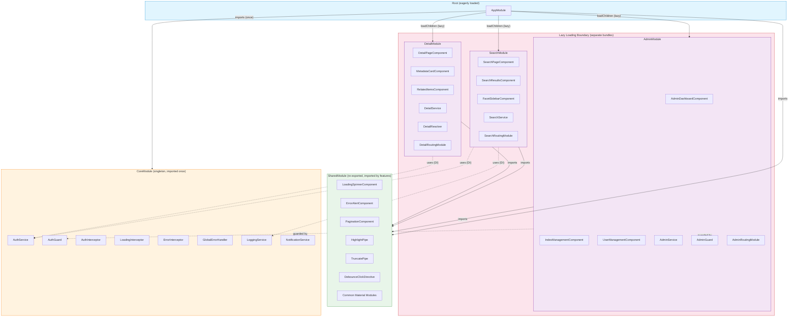

# Module Boundary Architecture

Angular 14 module structure showing import relationships, lazy loading boundaries, and what each module owns.

## Mermaid Diagram



## Text Description

### Module Inventory

#### AppModule (Root)

| Attribute | Value |
|-----------|-------|
| **Role** | Application root. Bootstraps the app, wires top-level routing, imports CoreModule exactly once. |
| **Contains** | `AppComponent` (shell: router-outlet, top nav, notification area), `AppRoutingModule` (top-level routes with lazy `loadChildren`). |
| **Imports** | `BrowserModule`, `HttpClientModule`, `CoreModule`, `SharedModule`, `AppRoutingModule` |
| **Exports** | Nothing (root module never exports) |
| **Loading** | Eagerly loaded at bootstrap |

#### CoreModule (Singleton Services)

| Attribute | Value |
|-----------|-------|
| **Role** | Houses application-wide singletons. Imported exactly once by AppModule. Contains a constructor guard that throws if imported a second time. |
| **Contains** | `AuthService` (JWT token management, login/logout, token refresh), `AuthGuard` (CanActivate, checks authentication), `AuthInterceptor` (attaches Bearer token to outgoing requests), `LoadingInterceptor` (sets/clears global loading state), `ErrorInterceptor` (catches HTTP errors, transforms to typed errors, triggers notifications), `GlobalErrorHandler` (implements ErrorHandler, catches unhandled exceptions, logs to backend), `LoggingService` (structured logging, ships errors to monitoring), `NotificationService` (toast/snackbar messages for user feedback) |
| **Imports** | `CommonModule` |
| **Exports** | Nothing (services are provided via `providedIn: 'root'` or module providers array -- no component exports needed) |
| **Loading** | Eagerly loaded (imported by AppModule) |
| **Guard** | `constructor(@Optional() @SkipSelf() parentModule: CoreModule)` throws if `parentModule` exists, preventing duplicate singleton registration |

#### SharedModule (Reusable UI)

| Attribute | Value |
|-----------|-------|
| **Role** | Common UI building blocks. Imported by every feature module that needs shared components, directives, or pipes. Stateless -- no services, no singletons. |
| **Contains** | `LoadingSpinnerComponent` (overlay spinner bound to loading state), `ErrorAlertComponent` (displays typed error messages with retry action), `PaginationComponent` (page navigation with total/pageSize inputs), `HighlightPipe` (highlights search terms in result text), `TruncatePipe` (truncates long strings with ellipsis), `DebounceClickDirective` (prevents rapid duplicate clicks), Common Angular Material modules re-exported for convenience |
| **Imports** | `CommonModule`, `ReactiveFormsModule`, `RouterModule`, `MatButtonModule`, `MatIconModule`, `MatCardModule`, `MatProgressSpinnerModule`, `MatSnackBarModule` |
| **Exports** | All components, directives, pipes listed above, plus re-exported Material modules, `CommonModule`, `ReactiveFormsModule` |
| **Loading** | Loaded per feature module bundle (tree-shaken per lazy chunk) |

#### SearchModule (Feature -- Lazy Loaded)

| Attribute | Value |
|-----------|-------|
| **Role** | Search functionality. Owns the search page, results rendering, and faceted filtering. |
| **Contains** | `SearchPageComponent` (orchestrates search form, results, and facets), `SearchResultsComponent` (renders result list with highlights), `FacetSidebarComponent` (displays aggregation buckets as filter controls), `SearchService` (calls API, manages search state via BehaviorSubjects), `SearchRoutingModule` (child routes: `/search`, `/search?q=...`) |
| **Imports** | `CommonModule`, `SharedModule`, `SearchRoutingModule`, `ReactiveFormsModule` |
| **Exports** | Nothing (feature modules do not export -- they are routed to, not composed into other templates) |
| **Loading** | Lazy loaded via `loadChildren: () => import('./search/search.module').then(m => m.SearchModule)` |
| **Route** | `/search` |

#### DetailModule (Feature -- Lazy Loaded)

| Attribute | Value |
|-----------|-------|
| **Role** | Document detail view. Shows full document content, metadata, and related items. |
| **Contains** | `DetailPageComponent` (full document display), `MetadataCardComponent` (structured metadata sidebar), `RelatedItemsComponent` (shows related documents from ES "more like this"), `DetailService` (fetches single document by ID), `DetailResolver` (pre-fetches document data before route activation, redirects to error page on failure), `DetailRoutingModule` (child routes: `/detail/:id`) |
| **Imports** | `CommonModule`, `SharedModule`, `DetailRoutingModule` |
| **Exports** | Nothing |
| **Loading** | Lazy loaded via `loadChildren` |
| **Route** | `/detail/:id` |

#### AdminModule (Feature -- Lazy Loaded, Guarded)

| Attribute | Value |
|-----------|-------|
| **Role** | Administrative functions. Index management, user management. Protected by both authentication and authorization guards. |
| **Contains** | `AdminDashboardComponent` (admin overview with system stats), `IndexManagementComponent` (reindex, create/delete indices), `UserManagementComponent` (user roles, permissions), `AdminService` (admin API calls), `AdminGuard` (CanActivate, checks admin role), `AdminRoutingModule` (child routes: `/admin`, `/admin/indices`, `/admin/users`) |
| **Imports** | `CommonModule`, `SharedModule`, `AdminRoutingModule`, `ReactiveFormsModule` |
| **Exports** | Nothing |
| **Loading** | Lazy loaded via `loadChildren` |
| **Route** | `/admin` (guarded by `AuthGuard` then `AdminGuard`) |

### What Crosses Module Boundaries

| Boundary | What Crosses | Mechanism |
|----------|-------------|-----------|
| AppModule -> CoreModule | Singleton service registration | `imports: [CoreModule]` (once only) |
| AppModule -> Feature Modules | Route activation | `loadChildren` in `AppRoutingModule` (lazy) |
| Feature Module -> SharedModule | UI components, pipes, directives | `imports: [SharedModule]` in each feature module |
| Feature Module -> CoreModule services | Service injection | Angular DI (services are `providedIn: 'root'`, available everywhere without import) |
| Feature Module -> Feature Module | **Nothing crosses directly** | Feature modules are isolated. Cross-feature navigation uses `Router.navigate()`. Shared state uses CoreModule services. |
| Interceptors -> All HTTP calls | Request/response transformation | `HTTP_INTERCEPTORS` multi-provider in CoreModule, applied globally by HttpClient |
| Guards -> Routes | Access control | `canActivate` array on route definitions in AppRoutingModule |

### Bundle Boundaries

```
main.js (eagerly loaded)
  ├── AppModule
  ├── CoreModule
  └── SharedModule (base)

search.chunk.js (loaded on /search navigation)
  └── SearchModule + SharedModule re-exports

detail.chunk.js (loaded on /detail/:id navigation)
  └── DetailModule + SharedModule re-exports

admin.chunk.js (loaded on /admin navigation, after guard check)
  └── AdminModule + SharedModule re-exports
```

Feature modules are completely independent bundles. A user who only searches never downloads the admin code. The router triggers the download on first navigation to a lazy route.
